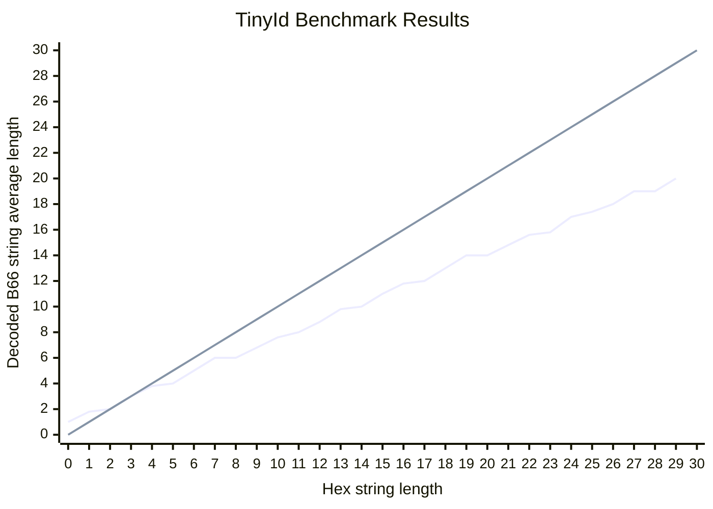

## TinyId Benchmark Results

## Data Summary

| Hex Length | B66 Length | B66 Length Ratio |
| ---------- | ---------- | ---------------- |
| 0          | 1          | 0                |
| 1          | 1.8        | 1                |
| 2          | 2          | 0.9              |
| 3          | 3          | 0.67             |
| 4          | 3.8        | 0.75             |
| 5          | 4          | 0.76             |
| 6          | 5          | 0.67             |
| 7          | 6          | 0.71             |
| 8          | 6          | 0.75             |
| 9          | 6.8        | 0.67             |
| 10         | 7.6        | 0.68             |
| 11         | 8          | 0.69             |
| 12         | 8.8        | 0.67             |
| 13         | 9.8        | 0.68             |
| 14         | 10         | 0.7              |
| 15         | 11         | 0.67             |
| 16         | 11.8       | 0.69             |
| 17         | 12         | 0.7              |
| 18         | 13         | 0.67             |
| 19         | 14         | 0.68             |
| 20         | 14         | 0.7              |
| 21         | 14.8       | 0.67             |
| 22         | 15.6       | 0.67             |
| 23         | 15.8       | 0.68             |
| 24         | 17         | 0.66             |
| 25         | 17.4       | 0.68             |
| 26         | 18         | 0.67             |
| 27         | 19         | 0.67             |
| 28         | 19         | 0.68             |
| 29         | 20         | 0.66             |
| 30         | undefined  | 0.67             |
