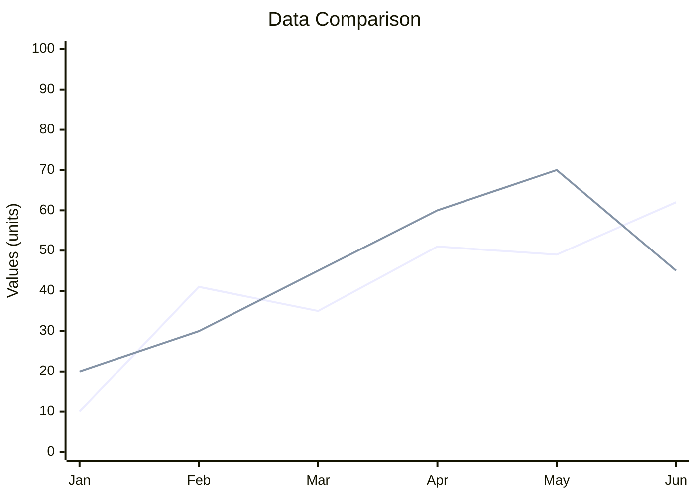

# TinyID Data Comparison

The following Mermaid chart demonstrates a comparison between two data lines:

### Chart Description:

- The chart shows two data lines over a 6-month period
- X-axis represents months from January to June
- Y-axis shows values from 0 to 100
- Line 1 and Line 2 demonstrate different trends over time
